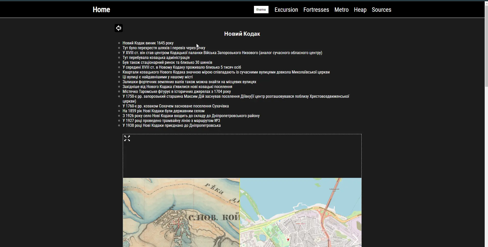

# History-walk (web-site)

### Video preview:

### Website:
https://history-walk.vercel.app

### Description:
A site with a description of the route of an excursion around city objects, with notes on history, photographs of places, links to text and video resources, maps, and other historical and geographical resources of the city.

### Resources used:
- https://vercel.com
